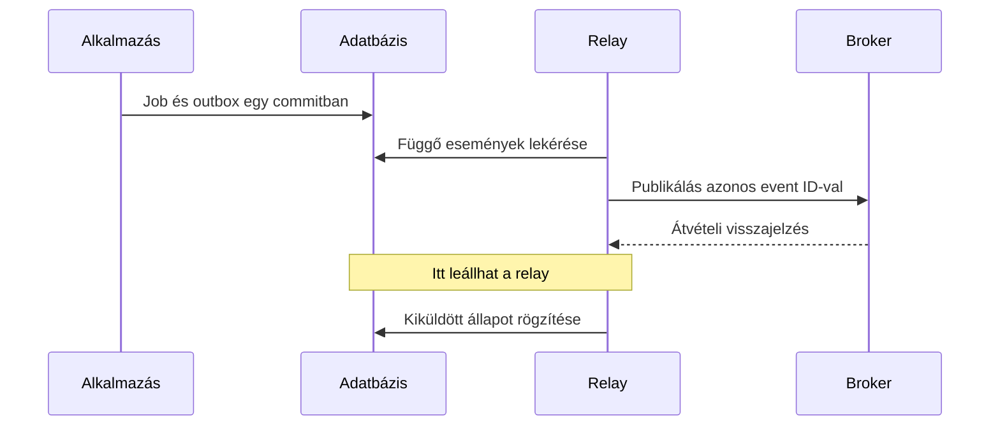

# Outbox, publikálási bizonytalanság és helyreállítás

## Mit kell tudnod?

- Az adatbázis és broker közti dual-write hibát felismerni.
- Outbox rekordot az üzleti változással együtt írni.
- A relay újrapublikálását és sorrendjét megtervezni.

## Magyarázat

Ha a job mentése és a brokerpublikálás két külön művelet, köztük összeomolhat a folyamat. Az outbox a „ki kell küldeni ezt az eseményt” szándékot ugyanabban az adatbázis-tranzakcióban rögzíti, mint a jobot. Egy relay később publikálja a függő eseményeket.

Az outbox nem tünteti el az összes bizonytalanságot: a broker átveheti az eseményt, majd a relay leállhat, mielőtt helyben kiküldöttnek jelölné. A következő futás újrapublikálhatja. Ezért a stabil event ID és az idempotens fogyasztó együtt fontos.



## Kódpélda: publikálás után elmaradó jelölés

A broker helyett listát használunk; a fail_after_publish kontrollált hibát injektál.

```python
from contextlib import closing
import sqlite3
import pytest

def create_job(db, job_id):
    db.execute('BEGIN')
    try:
        db.execute('INSERT INTO jobs VALUES (?)', (job_id,))
        db.execute('INSERT INTO outbox VALUES (?, ?, 0)', (f'created:{job_id}', job_id))
        db.execute('COMMIT')
    except BaseException:
        if db.in_transaction:
            db.execute('ROLLBACK')
        raise

def relay_once(db, publish, fail_after_publish=False):
    rows = db.execute('SELECT event_id, job_id FROM outbox WHERE sent = 0 ORDER BY event_id').fetchall()
    for event_id, job_id in rows:
        publish(event_id, job_id)
        if fail_after_publish:
            raise RuntimeError('injected relay failure')
        db.execute('UPDATE outbox SET sent = 1 WHERE event_id = ?', (event_id,))

def test_relay_can_publish_twice():
    with closing(sqlite3.connect(':memory:', isolation_level=None)) as db:
        db.executescript("""
            CREATE TABLE jobs(id INTEGER PRIMARY KEY);
            CREATE TABLE outbox(event_id TEXT PRIMARY KEY, job_id INTEGER, sent INTEGER);
        """)
        create_job(db, 7)
        delivered = []
        publish = lambda event_id, job_id: delivered.append((event_id, job_id))
        with pytest.raises(RuntimeError):
            relay_once(db, publish, fail_after_publish=True)
        assert db.execute('SELECT sent FROM outbox').fetchone() == (0,)
        relay_once(db, publish)
        assert delivered == [('created:7', 7), ('created:7', 7)]
        relay_once(db, publish)
        assert len(delivered) == 2
```

A teszt éppen a duplikált publikálás lehetőségét igazolja. Nem hiba a tesztben, hanem kezelendő elosztott állapot. A [deduplikációs fejezet](03-idempotent-consumers.md) mutatja, hogyan védhető a fogyasztó helyi adatbázishatása.

## Senior döntések és tipikus hibák

A tanpélda egy relayt feltételez és teljes kis listát olvas. Éles környezetben batch, konkurens claim, újrafelvehető lease és megőrzési szabály kell. Lease lejárta után egy régi worker még futhat; fencing token vagy verziófeltétel akadályozhatja meg, hogy elavult tulajdonos írjon.

Ne tarts nyitott DB-tranzakciót korlátlan broker-várakozás alatt. A claim/publish/mark határokat úgy tervezd, hogy hiba után visszatérhess, és a duplikáció elfogadható maradjon. A sent nem feltétlenül jelenti, hogy a fogyasztó feldolgozta az eseményt.

Figyeld a legrégebbi függő outbox rekord korát, a próbák számát és a tartósan hibás eseményeket. A rendezés itt csak determinisztikus tesztadat; több relay és retry mellett globális sorrendet nem garantál. Aggregátumonkénti sorrendhez külön sorszám vagy verzió kell.

## Interview questions

**What failure window remains with an outbox?**

Válaszvázlat: A broker átvette, de a helyi sent jelölés elmaradt; emiatt azonos esemény újrapublikálható.

**Why can an expired lease still be dangerous?**

Válaszvázlat: A korábbi tulajdonos még futhat és írhat; a lejárat önmagában nem állítja le, fencing/verzióellenőrzés kellhet.

## Önellenőrzés

- [ ] Az outboxot nem nevezem exactly-once kézbesítésnek.
- [ ] A publikálási jelölést nem keverem a fogyasztói sikerrel.

## Kapcsolódó gyakorlat

[R05 – önálló feladat](../../../exercises/senior-python/11-reliable-services.md#r05)

## Forrás és továbbolvasás

[AWS transactional outbox](https://docs.aws.amazon.com/prescriptive-guidance/latest/cloud-design-patterns/transactional-outbox.html)

[Témakör áttekintése](README.md) · [Teljes tudástérkép](../README.md)
