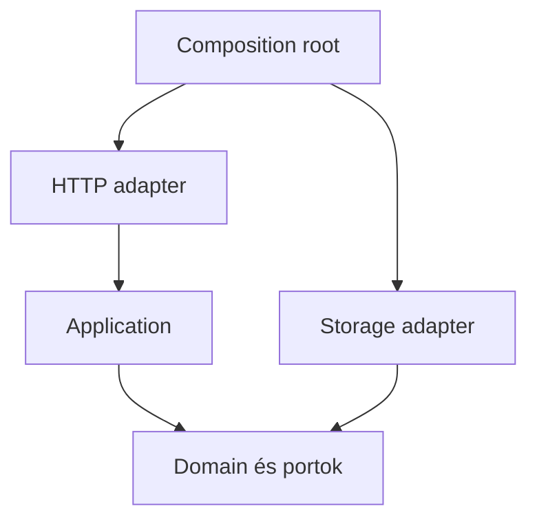

# Modulhatárok, cohesion és függőségi irányok

## Mit kell tudnod?

- Üzleti felelősség mentén húzni modulhatárt.
- A domainlogikát leválasztani HTTP-ről és tárolótechnológiáról.
- Az absztrakció költségét is megindokolni.

## Magyarázat

A cohesion azt jelzi, hogy egy modul elemei mennyire egy összetartozó felelősséget szolgálnak. A loose coupling azt célozza, hogy egy változás ne követeljen sok távoli, egyeztetett módosítást. Sok mappa vagy interfész önmagában nem adja meg ezt: egy megosztott, mindenki által módosított adatmodell erős kapcsolódás marad.

FastAPI-rétegben a HTTP-szerződés, validáció és státuszkód van. Az alkalmazási use case vezeti az üzleti lépéseket. A domain szabályait nem HTTPException fejezi ki. Az adapter fordít SQLAlchemy, broker vagy külső API és az alkalmazás szerződése között.

## Függőségi térkép



A nyilak forráskódbeli függőséget jelentenek, nem futási sorrendet. A composition root választja ki és adja át az adaptert. Futáskor az alkalmazás hívhatja az átadott storage objektumot úgy, hogy nem importálja annak konkrét osztályát.

## Kódpélda: üzleti döntés HTTP nélkül

```python
from dataclasses import dataclass
from typing import Protocol
import pytest

@dataclass(frozen=True)
class Job:
    owner: str
    status: str

class JobReader(Protocol):
    def get(self, job_id: str) -> Job | None: ...

class JobNotFound(Exception):
    pass

def read_status(reader: JobReader, tenant: str, job_id: str) -> str:
    job = reader.get(job_id)
    if job is None or job.owner != tenant:
        raise JobNotFound(job_id)
    return job.status

class MemoryReader:
    def __init__(self):
        self.jobs = {'j1': Job('tenant-a', 'queued')}

    def get(self, job_id: str) -> Job | None:
        return self.jobs.get(job_id)

def test_owner_can_read():
    assert read_status(MemoryReader(), 'tenant-a', 'j1') == 'queued'

@pytest.mark.parametrize('job_id', ['j1', 'missing'])
def test_other_tenant_cannot_observe_job(job_id):
    with pytest.raises(JobNotFound):
        read_status(MemoryReader(), 'tenant-b', job_id)
```

Azonos kivételkategória jelzi a hiányzó és az idegen jobot, így a HTTP-adapter egységes publikus választ adhat. A tenantot a hitelesített kontextusból kell átadni; a teszt nem tartalmaz hitelesítést. A DB-adapterben célszerű már a lekérdezést tenanttal szűrni. A minta csak kis olvasási use case, nem univerzális repository vagy konkurens hozzáférési garancia.

## Senior döntések és tipikus hibák

Nem kell minden függvény elé Protocol. Itt azért hasznos, mert a tároló mellékhatásos határ, több megvalósítás és külön tesztelés indokolt. Egy tiszta összeadó függvényhez az interfészréteg több zajt hozna, mint értéket.

A tranzakcióhatár az alkalmazási művelethez igazodjon: két repository önálló commitja megszüntetheti a use case atomiságát. A domain ne kapjon ORM-sessiont csak azért, hogy kényelmesebb legyen a mentés. Nagy listázó lekérdezés viszont lehet célzott query adapter; nem kell minden sort gazdag domainobjektummá építeni.

A körkörös importot ne csak függvényen belüli importtal fedd el. Kérdezd meg, rossz helyen van-e a közös szerződés vagy összemosódtak-e a felelősségek.

## Interview questions

**How can application code call a database without depending on its implementation?**

Válaszvázlat: Az alkalmazás egy saját szerződéshez kötődik; a composition root konkrét adaptert ad át. Futási hívás és importfüggőség eltér.

**When would you avoid introducing an interface?**

Válaszvázlat: Ha nincs érdemi mellékhatásos határ vagy variáció, és a függvény/modul már világos szerződést ad.

## Önellenőrzés

- [ ] A diagram nyilait importként tudom értelmezni.
- [ ] Meg tudom nevezni az üzleti tranzakció tulajdonosát.

## Kapcsolódó gyakorlat

[SD02 – önálló feladat](../../../exercises/senior-python/14-design-and-collaboration.md#sd02)

## Forrás és továbbolvasás

[Python typing Protocol](https://docs.python.org/3.12/library/typing.html#typing.Protocol)

[Alistair Cockburn: Hexagonal architecture](https://alistair.cockburn.us/hexagonal-architecture/)

[Témakör áttekintése](README.md) · [Teljes tudástérkép](../README.md)
